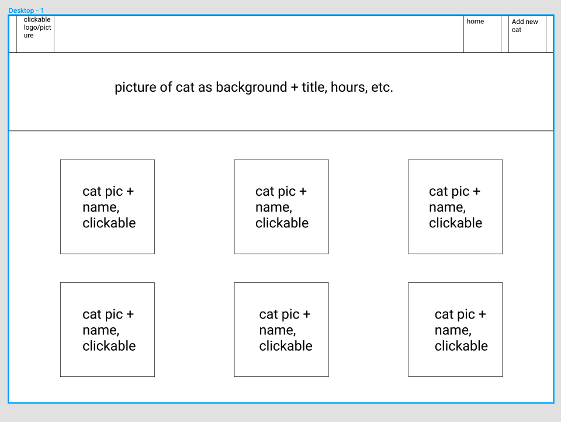
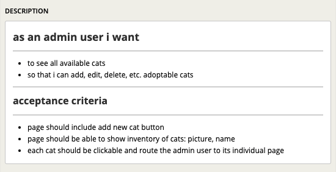
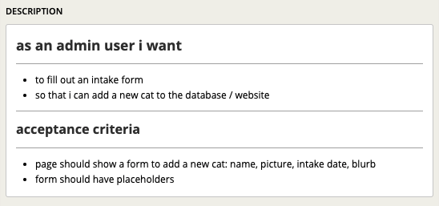
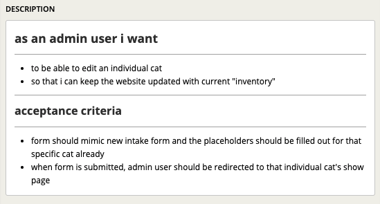
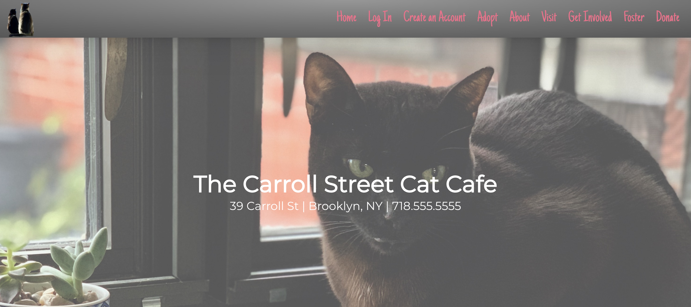
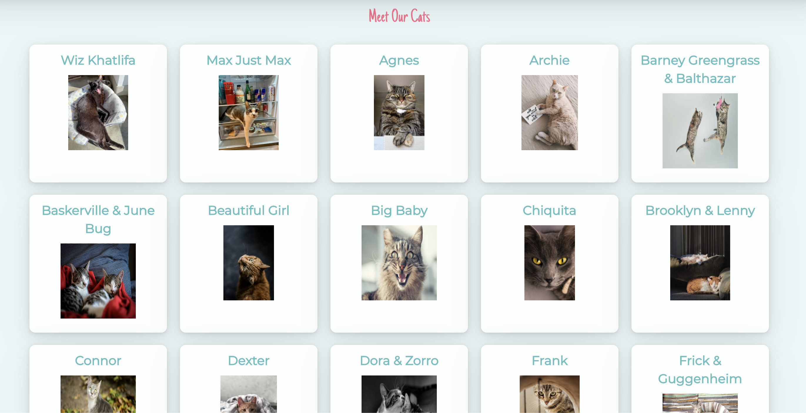
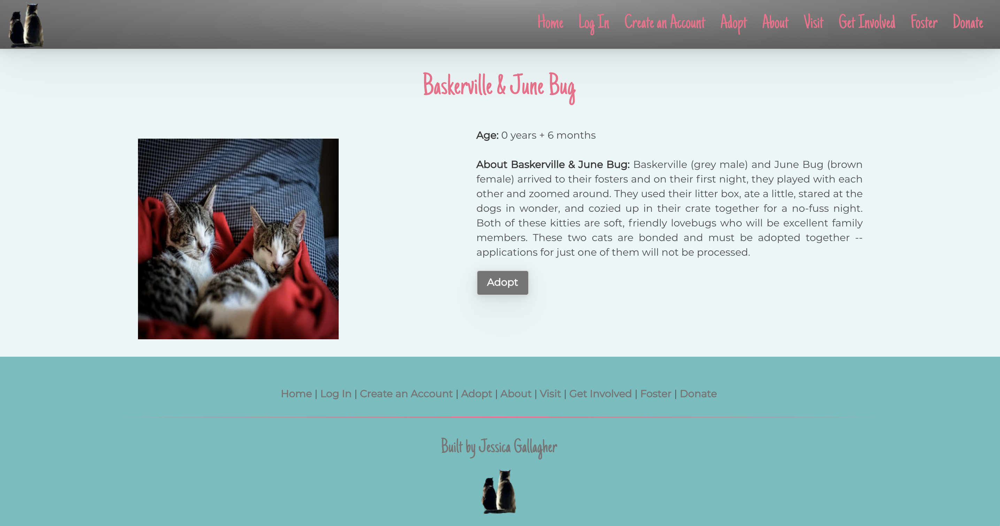
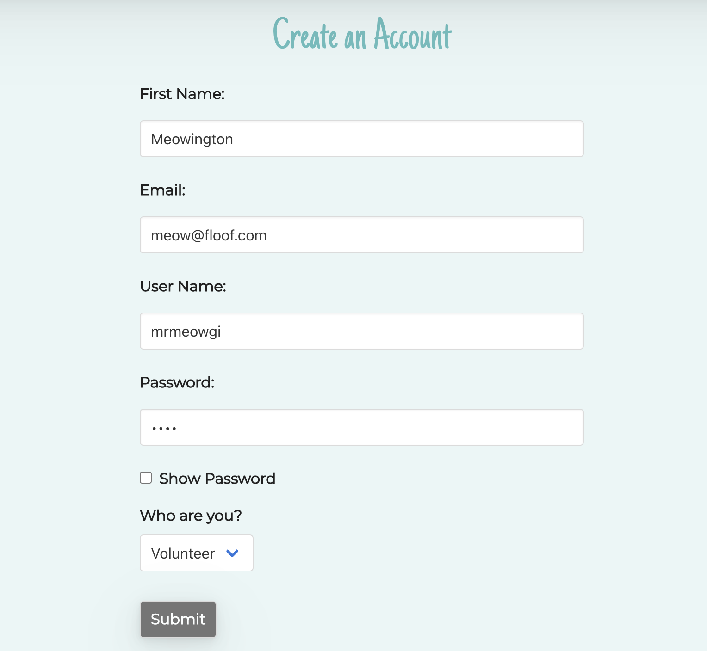
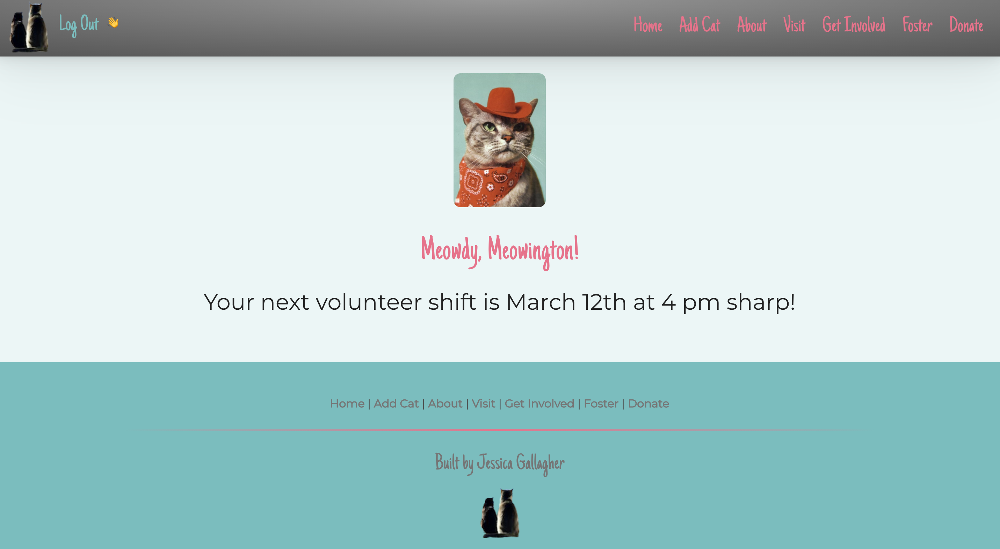
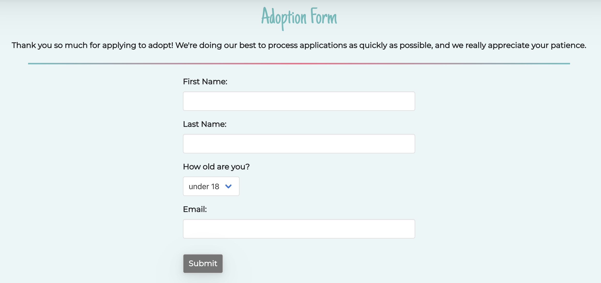

# :smile_cat: Cat Cafe

## Table of Contents

  1. [Description](#description)
  1. [Ingredients](#woman_technologist-ingredients)
  1. [Features](#rocket_features)
  1. [Sample Wireframe](#framed_picture-sample-wireframe)
  1. [Sample User Stories](#spiral_notepad-sample-user-stories)
  1. [Sample Images](#camera_flash-sample-images)
  1. [RESTful Routes](#world_map-restful-routes)
  1. [Coming Soon](#ice_cube-coming-soon)

## Description

The Cat Cafe website is an ongoing project for the [Brooklyn Cat Cafe](https://catcafebk.com/) where I volunteer and from where I adopted my two cats. I was asked to do an overhaul of their current website, but after seeing their code, I realized that it was time to take my freelancing to the next level and actually become a software engineer.

As a client-centric developer, I start by segmenting my audience and build out functionality that matches. For this project, I knew that a great UI and excellent styling would make a boring website with a ton of pictures and forms really pop. My personality shows on the confirmation pages, however, it's fitting for my audience. One unsolved problem remains in this release: when a user creates an account and tries to click on ``Home``, it resets the session and the user has to log in. On the one hand, it's good practice for remembering log in information, but an instant, forced log in isn't my preference. I cut corners by rendering views instead of using redirects, and the bugs started multiplying soon after (all squashed now :bug:). This is something I'll address in the next version since this is meant to be a fully functioning website.

This version allows website visitors to see adoptable cats and each cat's information, submit an adoption form, and create user accounts with different levels of access. The highest level of user access demonstrates all 7 **RESTful routes** and full **CRUD**. Have a look for yourself [here](https://desolate-reaches-17722.herokuapp.com). 

Finally, this version contains navigation menu items that link to the [Brooklyn Cat Cafe](https://catcafebk.com/). I put these items there for a few reasons: 1. The navigation menu looked funny with just three options; 2. It's a reminder for me to pick up where I left off; 3. It's an opportunity for you to learn (if you're interested!) about the first and only cat cafe located in Brooklyn. It's currently the only cat cafe in New York City that was founded by and currently managed by women. 

## :woman_technologist: Ingredients
***Please refer to the ``RESOURCES.md`` file for credit and citation information.***

-   Languages:

    -   HTML5
    -   CSS3
    -   JavaScript
    -   jQuery
    -   EJS

-   Design:

    -   Bulma CSS
    -   Google Fonts
    -   Figma
    -   WebGradients
    -   PALETTELIST

-   [Pivotal Tracker](https://www.pivotaltracker.com/projects/2490513)

-   Build:

    -   :atom: Atom Text Editor
    -   MongoDB / Mongoose ODM
    -   Express
    -   Node.js
    -   postman
    -   Heroku

## :rocket: Features

-   Read-Only Experience:

    - Viewers can see all adoptable cats on one page
    - Viewers can click on a cat and see that cat's details
    - Viewers are prompted to create an account or log in if they click on the adoption button
    - When a viewer creates an account, they'll see a welcome page and have moved into the next tier of access

-   Visitor Experience (Users):

    - Visitors are greeted with a welcome page when they log in
    - Viewers can see all adoptable cats on one page
    - Visitors can click on a cat and view that cat's details
    - Visitors can submit an adoption form
    - When a visitor submits an adoption form, they'll see a confirmation page

-   Volunteer Experience (Admin Users):

    - Volunteers are greeted with a welcome page when creating an account or logging in
    - Volunteers' welcome pages are unique to them and contain information regarding their next scheduled shift
    - Volunteers can see all adoptable cats on one page
    - Visitors can click on a cat and view that cat's details
    - Volunteers can add, edit, and delete cats
    - When a visitor submits an adoption form, they'll see a confirmation page

-   Mobile-friendly, responsive design

-   MVC file structure

-   Multiple models

-   EJS Partials

-   Cat puns :joy_cat:

## :framed_picture: Sample Wireframe

## :spiral_notepad: Sample User Stories

## :camera_flash: Sample Images

## :world_map: RESTful Routes

**Core Website Flow**
|#|Action|URL|HTTP|View|Mongoose Method|
|:---:|:---:|:---:|:---:|:---:|:---:|
|1| Index | /cats | GET | index.ejs | Cat.find() |
|2| Show | /cats/:id | GET | show.ejs | Cat.findById |
|3| New | /cats/new | GET | new.ejs | none |
|4| Create | /cats/ | POST| none | Cat.create(req.body) |
|5| Edit | /cats/:id | GET | edit.ejs | Cat.findById |
|6| Update | /cats/:id/edit | PUT | none | Cat.findByIdAndUpdate |
|7| Destroy | /cats/:id | DELETE | none | Cat.findByIdAndRemove |

**Account Creation Flow**
|#|Action|URL|HTTP|View|Mongoose Method|
|:---:|:---:|:---:|:---:|:---:|:---:|
|1| New | /new | GET | new.ejs | none |
|2| Create | / | POST | none | User.create |

**Sessions**
|#|Action|URL|HTTP|View|Mongoose Method|
|:---:|:---:|:---:|:---:|:---:|:---:|
|1| New | /new | GET | new.ejs | none |
|2| Create | / | POST | none | User.findOne |
|3| Destroy | / | DELETE | none | none |

**Adoption Flow**
|#|Action|URL|HTTP|View|Mongoose Method|
|:---:|:---:|:---:|:---:|:---:|:---:|
|1| New | /new | GET | adoption.ejs | none |
|2| Index | /confirm | GET | visitor_adopt_confirm.ejs | none |
|3| Create | / | POST | none | Adopt.create |

## :ice_cube: Coming Soon

- [ ] Responsive design improvements
- [ ] Accessibility improvements
- [ ] Email confirmations
- [ ] Identification of adopted cats instead of deleting them
- [ ] Adoption stories submitted by adopters with options to like, comment, and share
- [ ] Latest "Mews" blog
- [ ] Confirmation modals for submissions, edits, and deletions of cats
- [ ] Transition to React :crossed_fingers:
